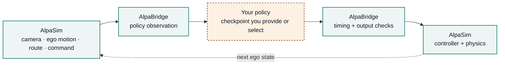
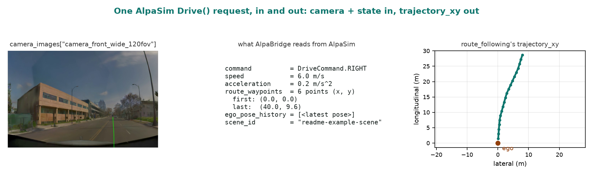

# AlpaBridge

<p align="center">
  <a href="https://github.com/amtellezfernandez/AlpaBridge/actions/workflows/ci.yml"></a>
  <a href="LICENSE"></a>
  
</p>

<p align="center">
  <strong>Run trajectory policies through AlpaSim's live external-driver loop.</strong><br>
  <a href="docs/getting-started.md">Get started</a> |
  <a href="docs/README.md">Documentation</a> |
  <a href="docs/cli.md">CLI reference</a> |
  <a href="docs/design.md">Architecture</a>
</p>

AlpaBridge is an installable policy adapter and run toolchain for
[NVIDIA AlpaSim](https://github.com/NVlabs/alpasim). It translates live camera,
ego-motion, command, and route messages into a compact trajectory-policy
interface, converts the policy output to AlpaSim's trajectory format, and lets
AlpaSim's controller and physics advance the next ego state.

It also handles the work around the adapter: checkout setup, runtime readiness,
scene batching, retries, provenance, run audits, and support bundles. AlpaBridge is
not a simulator and does not introduce a new driving policy.

|  |  |
| --- | --- |
| **Tested** | 243 automated tests, ruff-clean, enforced in CI on every push |
| **Installable** | One command (`uv sync`), builds a real wheel, smoke-tested fresh on every merge |
| **Self-checking** | `alpabridge-doctor` verifies the install, entry points, and AlpaSim checkout before anything runs |
| **Auditable** | Every run retains its expanded config, provenance, driver events, and a support bundle |

## Demo

Two real AlpaSim rollouts, each a map view beside its camera feed,
labeled in-frame with the real scene/rollout IDs from each run's manifest.

<p align="center">
  
</p>

**Top — dynamic-camera rollout**
([config + hashes](artifacts/external/alpasim_dynamic_camera_rollout/)):

- **Map:** the ego (green) tracking its planned path (orange); the gray
  box is the same nearby vehicle visible in the camera panel.
- **Camera:** AlpaSim's live `sensorsim` render, with a motion-shadow
  trail — each frame blended with the real frame from `0.6` s and `1.2` s
  earlier — showing the feed changes frame to frame.

**Bottom — NAVSIM rollout**
([config + hashes](artifacts/external/alpasim_navsim_reactive_rollout/)):
the closed-loop-vs-log-replay case.

- **Map:** the driven path (orange) pulls away from the scene's logged
  path (dashed green), finishing `16.29` m off (`dist_to_gt_location`)
  and flagged `wrong_lane` (`collision_any` and `offroad` are both `0`).
- **Camera:** unchanged frame to frame — this checkpoint (NAVSIM
  EgoStatusMLP) is camera-blind by architecture, so AlpaSim served the
  same fixture frame on every request. AlpaBridge's frozen-camera guard
  exists to catch exactly this case (below).

How it works — AlpaSim owns everything except the amber box:



<details>
<summary>One camera per rollout, and the frozen-camera guard</summary>

Every rollout uses one camera because that's what the connected AlpaSim
vehicle rig has, not an adapter limit — see
[design.md](docs/design.md#camera-count-is-not-hardcoded).

Connected to a camera-validating model instead, this same frozen fixture
tripped AlpaBridge's freshness check: 4 `Drive` calls completed, then the
5th returned `INVALID_ARGUMENT` because the camera timestamp advanced but
the image didn't. Details: [NAVSIM
evidence](artifacts/external/alpasim_navsim_reactive_rollout/#camera-freshness-control).

</details>

## How It Works

In practice:

### A Real Example

<p align="center">
  
</p>

Generated by
[`scripts/render_readme_example.py`](scripts/render_readme_example.py): it
builds a `PredictionInput` (same shape as
[`tests/test_alpasim_integration.py`](tests/test_alpasim_integration.py)),
runs the shipped `route_following` preset, and plots the trajectory it
returned. Run the script yourself to reproduce it.

**What this means in practice:** you write one function — observation in,
trajectory out — for your policy. AlpaBridge handles AlpaSim's message
protocol, timing conversion, retries, and evidence capture around it.

### Model Presets

The same adapter surface supports four model presets:

| Preset | Purpose | Extra input |
| --- | --- | --- |
| `constant_velocity` | Dependency-light smoke baseline | None |
| `route_following` | Dependency-light waypoint baseline | None |
| `token_dagger_bc` | Adapter for a compatible learned token checkpoint | Local checkpoint |
| `direct_actor_planner` | Candidate planner using scene-matched actor state | Local actor proxy |

The first two presets are sufficient to test a checkout and execute the public
adapter without a private checkpoint. Both real rollouts above use AlpaSim
scenes this repo already ships presets for; runs on other datasets (nuScenes,
nuPlan, Argoverse 2) aren't recorded here yet — see
[compatible datasets](docs/womd-targeting.md) for what that would take.

## Install

Installation and command planning do not require a GPU:

```bash
uv sync --extra dev
uv run alpabridge-doctor --strict-installed --json
```

Live AlpaSim rollouts require x86_64 Linux, Docker, NVIDIA Container Toolkit, a
GPU, a local AlpaSim checkout, and local scene assets.

## Connect AlpaSim

Inspect the tracked override layer:

```bash
uv run alpabridge-setup \
  --alpasim-root /path/to/alpasim \
  --check-only
```

Apply it and run the readiness checks:

```bash
uv run alpabridge-setup --alpasim-root /path/to/alpasim
uv run alpabridge-ready \
  --alpasim-root /path/to/alpasim \
  --scene-preset fresh_3scene
```

The setup command validates the expected upstream layout before applying any
tracked file. The readiness command checks the local environment, Docker/GPU
availability, images, model inputs, and selected scene assets.

## Plan Or Execute

Materialize the exact driver and simulator commands without starting a rollout:

```bash
uv run alpabridge-launch \
  --mode print \
  --alpasim-root /path/to/alpasim \
  --model route_following \
  --scene-preset fresh_3scene
```

Execute the setup-to-evidence workflow:

```bash
uv run alpabridge-reproduce \
  --execute \
  --alpasim-root /path/to/alpasim \
  --model route_following \
  --scene-preset fresh_3scene \
  --run-dir runs/route_following \
  --evidence-dir runs/route_following/evidence \
  --json
```

For independent scene timeouts and retries, use `alpabridge-batch`. The toolchain
retains expanded configuration, model inputs, commands, simulator provenance,
driver events, summaries, and normalized audit output without committing gated
scene data or private checkpoints.

## Integration Test Results

Three real, retained AlpaSim runs back the claims above:

| Run | Result | What it proves |
| --- | --- | --- |
| [Dynamic-camera external driver](artifacts/external/alpasim_dynamic_camera_rollout/) | `pass`, `200` sim steps, live `sensorsim` camera render | The camera feed actually changes frame to frame — not a repeated-frame fixture. |
| [Reactive NAVSIM external driver](artifacts/external/alpasim_navsim_reactive_rollout/) | `197/197` finite outputs over one `19.93` s rollout | A public checkpoint, the driver, controller, and physics all complete one full feedback loop. |
| [E2E challenge-style conformance](artifacts/external/alpasim_e2e_challenge_conformance/) | `1/1` rollout completed, `197` `Drive` calls | The driver connects to AlpaSim's official challenge service and returns correctly-timed trajectories. |

These are integration checks, not model benchmarks: they prove the
plumbing works, not that any one policy drives well.

## Verify

```bash
make test    # 243 tests, no AlpaSim/GPU/checkpoint required
make verify  # + Ruff, coverage, fresh-checkout install smoke test, wheel/sdist build
```

Every push runs the same pipeline in CI: lint, the dependency-light
conformance tier, coverage, a fresh-checkout install, a wheel build, and an
install-from-wheel smoke test that exercises the real console-script
entry points. Nothing here requires AlpaSim scenes, a GPU, or a checkpoint.

## Scope

AlpaBridge answers one question: does your policy drive, live and
closed-loop, in a photorealistic simulator — not just on a logged
benchmark. It adapts any compatible trajectory-policy checkpoint to
AlpaSim's external-driver loop (camera, ego motion, route, command in; a
five-second trajectory out); no WOMD-trained checkpoint required.

**What it doesn't do:** convert WOMD scenarios into AlpaSim scenes. A
policy connected through AlpaBridge drives whatever scenes the connected
AlpaSim checkout provides, not recorded Waymo intersections. Waymax
targets a different problem (vectorized planning/behavior-prediction
research, no camera render), so neither substitutes for the other. Full
breakdown — WOMD/AlpaSim/Waymax sources, why AlpaSim and not Waymax, real
Waymo camera/LiDAR examples: [WOMD targeting](docs/womd-targeting.md).

## Documentation

- [CLI reference](docs/cli.md)
- [Architecture and adapter behavior](docs/design.md)
- [Getting started](docs/getting-started.md)
- [Reproducible runs](docs/reproduction.md)
- [AlpaSim E2E compatibility](docs/challenge-compatibility.md)
- [WOMD targeting and compatible datasets](docs/womd-targeting.md)
- [Changelog](docs/changelog.md)
- [Contributing](.github/CONTRIBUTING.md)
- [Code of conduct](.github/CODE_OF_CONDUCT.md)
- [Security policy](.github/SECURITY.md)

## License

AlpaBridge is released under the [BSD 3-Clause License](LICENSE) and is
citable via [`CITATION.cff`](CITATION.cff). Packaged third-party-derived
files and run media retain their
[third-party notices](LICENSES/THIRD_PARTY_NOTICES.md).

This independent project is not affiliated with, endorsed by, or sponsored by
Waymo or NVIDIA. It does not redistribute Waymo datasets, AlpaSim binaries,
gated scene assets, or policy checkpoints.
