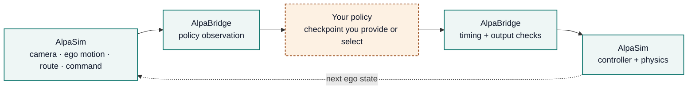

# AlpaBridge: A Platform for Evaluating Driving Policies in NVIDIA AlpaSim

<p align="center">
  <a href="https://github.com/amtellezfernandez/AlpaBridge/actions/workflows/ci.yml"></a>
  <a href="LICENSE"></a>
  
</p>

<p align="center">
  <strong>One interface, six policy backends and growing — from simple no-setup baselines to a real, published video-action model.</strong><br>
  <a href="docs/getting-started.md">Get started</a> |
  <a href="docs/README.md">Documentation</a> |
  <a href="docs/cli.md">CLI reference</a> |
  <a href="docs/design.md">Architecture</a>
</p>

AlpaBridge is a platform for running driving policies through
[NVIDIA AlpaSim](https://github.com/NVlabs/alpasim)'s live simulation loop
and evaluating how they actually drive — not just how they score against a
logged benchmark. Bring your own policy, or pick one of six built-ins, from
simple no-setup baselines to a real, published 318-million-parameter
video-action model (see [Policy Backends](#policy-backends) below).

AlpaSim sends AlpaBridge the live camera image, the car's own motion, the
current command, and the route. AlpaBridge passes these to your policy,
takes the trajectory it returns, converts it into the format AlpaSim needs,
and lets AlpaSim move the car forward.

AlpaBridge also sets up your AlpaSim checkout, checks it's ready to run,
runs many scenes in a row, retries failures, keeps a record of each run, and
packages logs for support.

## Demo

Two real AlpaSim runs, each shown as a map view next to its camera feed:

<p align="center">
  
</p>

- **Top** ([run files](artifacts/external/alpasim_dynamic_camera_rollout/)):
  the car (green) follows its planned path (orange); the camera panel is
  AlpaSim's live render — it changes frame to frame.
- **Bottom** ([run files](artifacts/external/alpasim_navsim_reactive_rollout/)):
  the driven path (orange) pulls away from the original recorded path
  (dashed green) — the gap between driving live and replaying a log. The
  camera never changes: this policy (NAVSIM EgoStatusMLP) doesn't use it, so
  AlpaSim kept sending the same image. AlpaBridge's frozen-camera check
  catches exactly this (below).

The loop:


```mermaid
flowchart LR
    A["AlpaSim<br/>camera · ego motion · route · command"] --> B["AlpaBridge<br/>policy observation"]
    B --> C["Your policy<br/>checkpoint you provide or select"]
    C --> D["AlpaBridge<br/>timing + output checks"]
    D --> E["AlpaSim<br/>controller + physics"]
    E -.->|next ego state| A

    style A fill:#eef6f5,stroke:#0f766e,stroke-width:1.5px,color:#0f172a
    style B fill:#eef6f5,stroke:#0f766e,stroke-width:1.5px,color:#0f172a
    style C fill:#fdf1e3,stroke:#92400e,stroke-width:1.5px,stroke-dasharray: 4 3,color:#0f172a
    style D fill:#eef6f5,stroke:#0f766e,stroke-width:1.5px,color:#0f172a
    style E fill:#eef6f5,stroke:#0f766e,stroke-width:1.5px,color:#0f172a
```

This shows the simplest case: one policy, AlpaSim driving it directly. Both
sides are actually swappable — any policy, checked by any evaluator — see
the diagram in [Extending AlpaBridge](docs/extending.md#evaluators) for the
full picture.

<details>
<summary>One camera per run, and the frozen-camera guard</summary>

Each run uses one camera because that's what the connected AlpaSim car has —
not a limit of AlpaBridge itself. See
[design.md](docs/design.md#camera-count-is-not-hardcoded) for more.

When we connected a policy that does check the camera, AlpaBridge's check
caught this same frozen image: the first 4 `Drive` calls worked, then the
5th failed with `INVALID_ARGUMENT`, because the camera's timestamp kept
moving forward but the picture didn't. Details: [NAVSIM
evidence](artifacts/external/alpasim_navsim_reactive_rollout/#camera-freshness-control).

</details>

## How It Works

### A Real Example

<p align="center">
  
</p>

Made by
[`scripts/render_readme_example.py`](scripts/render_readme_example.py). The
script builds one input, shaped the same way as in
[`tests/test_alpasim_integration.py`](tests/test_alpasim_integration.py),
runs the built-in `route_following` policy, and plots the trajectory it
returns. Run the script yourself to see the same thing (needs the `viz`
extra: `uv sync --extra viz`).

**In practice:** you write one function for your policy — it takes in what
the car currently sees and knows, and returns a trajectory. AlpaBridge
handles everything else: talking to AlpaSim, timing, retries, and saving
evidence of the run.

### Policy Backends

AlpaBridge ships six built-in policies:

| Policy | Purpose | Extra input |
| --- | --- | --- |
| `constant_velocity` | Simple baseline, no setup needed | None |
| `route_following` | Simple baseline that follows the route | None |
| `token_dagger_bc` | Adapter for your own trained BC/DAgger checkpoint — bring a proprietary or research model | A checkpoint file |
| `direct_actor_planner` | Privileged planner using ground-truth actor-state data — an oracle-style research baseline | An actor-state file |
| `navsim_ego_status_mlp` | Public NAVSIM checkpoint, validated end-to-end with retained rollout evidence | A checkpoint file |
| `vavam` | Public 318M-parameter video-action model, validated end-to-end with retained rollout evidence ([Valeo VideoActionModel](https://github.com/valeoai/VideoActionModel)) | A checkpoint + tokenizer checkpoint |

The first two need no checkpoint, so they're the fastest way to confirm
your AlpaSim setup works. `token_dagger_bc` and `direct_actor_planner` show
the platform adapting to your own proprietary models and privileged
planners; `navsim_ego_status_mlp` and `vavam` are public checkpoints with
retained end-to-end evidence. The last two policies only run through the
[standalone driver](docs/extending.md#evaluators); everything else works
with the steps below too.

Both real runs above use AlpaSim scenes that already have a preset in this
repo. Other datasets (nuScenes, nuPlan, Argoverse 2) aren't covered here
yet — see [compatible datasets](docs/womd-targeting.md) for what that
would take.

Want to run your own policy, or evaluate through something other than the
steps below (the AlpaSim E2E Challenge, or your own evaluator)? See
[Extending AlpaBridge](docs/extending.md).

## Install & Connect AlpaSim

There are two ways to run a policy: **inside AlpaSim itself** (this
section through [Plan Or Execute](#plan-or-execute) below), or through a
[**standalone driver**](docs/extending.md#evaluators) — for the AlpaSim
E2E Challenge or your own evaluator, skip straight there instead.

**Requirements for a real rollout** (installing itself needs none of this):

- x86_64 Linux
- Docker, plus the NVIDIA Container Toolkit
- A GPU
- A local AlpaSim checkout with scene assets (see [Get Scene
  Data](#get-scene-data) below)

Install AlpaBridge and connect it to your checkout — neither needs a GPU:

```bash
uv sync
uv run alpabridge-setup --alpasim-root /path/to/alpasim
```

Then check it's actually ready to run — this step needs Docker and a GPU,
since it launches a container to probe them:

```bash
uv run alpabridge-ready --alpasim-root /path/to/alpasim \
  --scene-preset fresh_3scene
```

`alpabridge-setup` applies AlpaBridge's changes to the checkout — add
`--check-only` first to preview them without applying anything.
`alpabridge-ready` checks your machine, Docker/GPU access, and the scenes
you picked.

## Get Scene Data

Only needed for running a policy inside AlpaSim itself above
(`alpabridge-launch` / `alpabridge-reproduce` with `--scene-preset`) — the
[standalone
driver](docs/extending.md#evaluators) supplies its own scenes instead.

Real scene files come from a **gated** Hugging Face dataset of real driving
scenes, reconstructed for simulation (NVIDIA's "NuRec"): [request
access](https://huggingface.co/datasets/nvidia/PhysicalAI-Autonomous-Vehicles-NuRec)
first if you don't have it yet, and expect that approval to take some time —
it's a manual review, not instant. Once you have access and an `HF_TOKEN`,
downloading the scenes your preset needs is one command (needs the
`alpasim` extra: `uv sync --extra alpasim`):

```bash
export HF_TOKEN=your-huggingface-token
uv run alpabridge-build-local-cache \
  --alpasim-root /path/to/alpasim \
  --scene-preset fresh_3scene
```

Want one specific scene instead of a whole preset? Use `--scene-id` (repeatable):

```bash
uv run alpabridge-build-local-cache \
  --alpasim-root /path/to/alpasim \
  --scene-preset fresh_3scene \
  --scene-id clipgt-90d1908c-9fdc-40ea-a5a1-351240aa323e
```

`--scene-preset` still picks which catalog to search; `--scene-id` narrows
which of that catalog's scenes are actually fetched.

Already have the scene files locally? Point at them with `--source-usdz-dir`
instead, and nothing is downloaded. `alpabridge-ready` (above) reports
whether the scenes a preset needs are already cached.

This is scoped to that one catalog — `--scene-id` and `--source-usdz-dir`
only change *which* of the catalog's scenes you fetch and *where from*, not
what scenes exist. Already have your own, complete USDZ file (e.g. from
NVIDIA's NuRec pipeline)? `alpabridge-register-custom-scene` adds it to
AlpaSim's own catalog so `--scene-id`/`--source-usdz-dir` accept it — see
[Getting Started](docs/getting-started.md#get-scene-data). It can't create
or repair a USDZ's own content, though; that's an upstream reconstruction
problem, not a catalog one.

## Plan Or Execute

This is what actually drives a scene: `--model` picks the policy (from
[Policy Backends](#policy-backends) above) and `--scene-preset` picks which
of the real scenes fetched in [Get Scene Data](#get-scene-data) to load.
Running it launches AlpaSim's Docker-based renderer and physics alongside a
driver process serving that policy, and drives the car through the chosen
scene(s) in real time — the same closed loop shown in the [Demo](#demo)
above.

Print the exact driver and simulator commands, without starting anything:

```bash
uv run alpabridge-launch \
  --mode print \
  --alpasim-root /path/to/alpasim \
  --model route_following \
  --scene-preset fresh_3scene
```

Run the same thing for real, start to finish:

```bash
uv run alpabridge-reproduce \
  --execute \
  --alpasim-root /path/to/alpasim \
  --model route_following \
  --scene-preset fresh_3scene \
  --run-dir runs/route_following \
  --evidence-dir runs/route_following/evidence \
  --json
```

To run many scenes with their own timeouts and retries, use
`alpabridge-batch`. Every run saves its full settings, model inputs, the
exact commands used, simulator records, driver events, summaries, and a
normalized audit — without saving any gated scene data or private
checkpoints.

## Integration Test Results

Three real, saved AlpaSim runs back this up:

| Run | Result | What it proves |
| --- | --- | --- |
| [Dynamic-camera external driver](artifacts/external/alpasim_dynamic_camera_rollout/) | `pass`, `200` sim steps, live `sensorsim` camera render | The camera image really changes every frame — it's not stuck on one picture. |
| [Reactive NAVSIM external driver](artifacts/external/alpasim_navsim_reactive_rollout/) | `197/197` finite outputs over one `19.93` s rollout | A public checkpoint, the driver, the controller, and the physics all complete one full loop. |
| [E2E challenge-style conformance](artifacts/external/alpasim_e2e_challenge_conformance/) | `197/197` `Drive` calls with a simple baseline, and again with the real 318M-parameter `vavam` policy ([details](docs/challenge-compatibility.md#a-second-run-with-a-real-policy-instead-of-a-baseline)) | The driver connects to AlpaSim's official challenge service and keeps working with a real policy, not just a simple baseline. |

These check that the pieces connect and work together — they don't score
how well any one policy drives.

## Scope

AlpaBridge answers one question: does your policy actually drive live in a
realistic simulator — not just score well on a recorded log. It connects any
compatible policy to AlpaSim's live loop: camera, car motion, route, and
command go in; a five-second trajectory comes out. You don't need a
checkpoint trained on the Waymo Open Motion Dataset (WOMD).

**Out of scope:** turning WOMD's recorded Waymo driving logs into AlpaSim
scenes. A policy connected through AlpaBridge drives whatever scenes your
AlpaSim checkout has, not recorded Waymo intersections. Waymax (a separate
Waymo tool) solves a different problem — planning research on WOMD logs,
with no camera image — so neither one replaces the other. For the full
comparison, and real Waymo camera/LiDAR examples, see [WOMD
targeting](docs/womd-targeting.md).

## Documentation

- [CLI reference](docs/cli.md)
- [Architecture and adapter behavior](docs/design.md)
- [Getting started](docs/getting-started.md)
- [Extending AlpaBridge (your own policy, your own evaluator)](docs/extending.md)
- [Reproducible runs](docs/reproduction.md)
- [AlpaSim E2E compatibility](docs/challenge-compatibility.md)
- [WOMD targeting and compatible datasets](docs/womd-targeting.md)
- [Changelog](docs/changelog.md)
- [Contributing](.github/CONTRIBUTING.md)
- [Code of conduct](.github/CODE_OF_CONDUCT.md)
- [Security policy](.github/SECURITY.md)

## License

AlpaBridge is released under the [BSD 3-Clause License](LICENSE), and you
can cite it using [`CITATION.cff`](CITATION.cff). Files and run media that
come from third parties keep their own
[third-party notices](LICENSES/THIRD_PARTY_NOTICES.md).

This is an independent project — it is not affiliated with, endorsed by, or
sponsored by Waymo or NVIDIA. It does not include or redistribute Waymo
datasets, AlpaSim binaries, gated scene files, or policy checkpoints.
