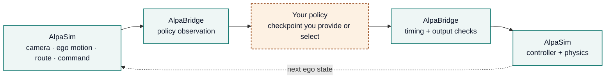
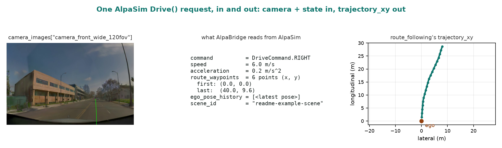

# AlpaBridge: Connect a Driving Policy to NVIDIA AlpaSim

<p align="center">
  <a href="https://github.com/amtellezfernandez/AlpaBridge/actions/workflows/ci.yml"></a>
  <a href="LICENSE"></a>
  
</p>

<p align="center">
  <strong>Run your driving policy through AlpaSim's live simulation loop.</strong><br>
  <a href="docs/getting-started.md">Get started</a> |
  <a href="docs/README.md">Documentation</a> |
  <a href="docs/cli.md">CLI reference</a> |
  <a href="docs/design.md">Architecture</a>
</p>

AlpaBridge connects your driving policy to
[NVIDIA AlpaSim](https://github.com/NVlabs/alpasim). AlpaSim sends AlpaBridge
the live camera image, the car's own motion, the current command, and the
route. AlpaBridge hands these to your policy in a simple format, takes the
trajectory your policy returns, converts it into the format AlpaSim needs,
and lets AlpaSim move the car forward using it.

AlpaBridge also sets up your AlpaSim checkout, checks it's ready to run,
runs many scenes in a row, retries failures, keeps a record of each run, and
packages logs for support.

Bring your own policy checkpoint — AlpaSim provides the simulator, and
AlpaBridge connects the two.

## Demo

Two real AlpaSim runs, each shown as a map view next to its camera feed:

<p align="center">
  
</p>

- **Top** ([run files](artifacts/external/alpasim_dynamic_camera_rollout/)):
  the car (green) follows its planned path (orange); the camera panel is
  AlpaSim's live render — it changes frame to frame.
- **Bottom** ([run files](artifacts/external/alpasim_navsim_reactive_rollout/)):
  the driven path (orange) pulls away from the original recorded path
  (dashed green) — the gap between driving live and replaying a log. The
  camera never changes: this policy (NAVSIM EgoStatusMLP) doesn't use it, so
  AlpaSim kept sending the same image. AlpaBridge's frozen-camera check
  catches exactly this (below).

The loop:


```mermaid
flowchart LR
    A["AlpaSim<br/>camera · ego motion · route · command"] --> B["AlpaBridge<br/>policy observation"]
    B --> C["Your policy<br/>checkpoint you provide or select"]
    C --> D["AlpaBridge<br/>timing + output checks"]
    D --> E["AlpaSim<br/>controller + physics"]
    E -.->|next ego state| A

    style A fill:#eef6f5,stroke:#0f766e,stroke-width:1.5px,color:#0f172a
    style B fill:#eef6f5,stroke:#0f766e,stroke-width:1.5px,color:#0f172a
    style C fill:#fdf1e3,stroke:#92400e,stroke-width:1.5px,stroke-dasharray: 4 3,color:#0f172a
    style D fill:#eef6f5,stroke:#0f766e,stroke-width:1.5px,color:#0f172a
    style E fill:#eef6f5,stroke:#0f766e,stroke-width:1.5px,color:#0f172a
```

<details>
<summary>One camera per run, and the frozen-camera guard</summary>

Each run uses one camera because that's what the connected AlpaSim car has —
not a limit of AlpaBridge itself. See
[design.md](docs/design.md#camera-count-is-not-hardcoded) for more.

When we connected a policy that does check the camera, AlpaBridge's check
caught this same frozen image: the first 4 `Drive` calls worked, then the
5th failed with `INVALID_ARGUMENT`, because the camera's timestamp kept
moving forward but the picture didn't. Details: [NAVSIM
evidence](artifacts/external/alpasim_navsim_reactive_rollout/#camera-freshness-control).

</details>

## How It Works

### A Real Example

<p align="center">
  
</p>

Made by
[`scripts/render_readme_example.py`](scripts/render_readme_example.py). The
script builds one input, shaped the same way as in
[`tests/test_alpasim_integration.py`](tests/test_alpasim_integration.py),
runs the built-in `route_following` policy, and plots the trajectory it
returns. Run the script yourself to see the same thing (needs the `viz`
extra: `uv sync --extra viz`).

**In practice:** you write one function for your policy — it takes in what
the car currently sees and knows, and returns a trajectory. AlpaBridge
handles everything else: talking to AlpaSim, timing, retries, and saving
evidence of the run.

### Model Presets

AlpaBridge ships four built-in policies:

| Preset | Purpose | Extra input |
| --- | --- | --- |
| `constant_velocity` | Simple baseline, no setup needed | None |
| `route_following` | Simple baseline that follows the route | None |
| `token_dagger_bc` | Wraps a compatible trained model | A checkpoint file |
| `direct_actor_planner` | Planner that uses other cars' real positions | An actor-state file |

The first two need no checkpoint, so they're the easiest way to test your
AlpaSim setup. All four still need real local scene files — see [Get Scene
Data](#get-scene-data) below. Both real runs above use AlpaSim scenes that
already have a preset in this repo. Other datasets (nuScenes, nuPlan,
Argoverse 2) aren't covered here yet — see [compatible
datasets](docs/womd-targeting.md) for what that would take.

## Install

You don't need a GPU to install or plan a run:

```bash
uv sync
uv run alpabridge-doctor --strict-installed --json
```

A real AlpaSim rollout needs x86_64 Linux, Docker, the NVIDIA Container
Toolkit, a GPU, a local AlpaSim checkout, and local scene files.

## Connect AlpaSim

Check what AlpaBridge would change in your AlpaSim checkout:

```bash
uv run alpabridge-setup \
  --alpasim-root /path/to/alpasim \
  --check-only
```

Apply the changes, then check that everything is ready:

```bash
uv run alpabridge-setup --alpasim-root /path/to/alpasim
uv run alpabridge-ready \
  --alpasim-root /path/to/alpasim \
  --scene-preset fresh_3scene
```

The setup command checks that your AlpaSim checkout looks as expected before
it changes anything. The readiness command checks your machine, Docker and GPU
access, images, model inputs, and the scenes you picked.

## Get Scene Data

Using [Run As A Standalone Driver](#run-as-a-standalone-driver) instead —
including the AlpaSim E2E Challenge? You can skip this section: that path
supplies its own scenes, no local scene data needed. This step is only for
the in-process path above (`alpabridge-launch` / `alpabridge-reproduce` with
`--scene-preset`).

Real scene files for that path come from a **gated** Hugging Face dataset:
[request
access](https://huggingface.co/datasets/nvidia/PhysicalAI-Autonomous-Vehicles-NuRec)
first if you don't have it yet, and expect that approval to take some time —
it's a manual review, not instant. Once you have access and an `HF_TOKEN`,
downloading the scenes your preset needs is one command (needs the
`alpasim` extra: `uv sync --extra alpasim`):

```bash
export HF_TOKEN=your-huggingface-token
uv run alpabridge-build-local-cache \
  --alpasim-root /path/to/alpasim \
  --scene-preset fresh_3scene
```

Already have the scene files locally? Point at them with `--source-usdz-dir`
instead, and nothing is downloaded. `alpabridge-ready` (above) reports
whether the scenes a preset needs are already cached.

## Plan Or Execute

Print the exact driver and simulator commands, without starting anything:

```bash
uv run alpabridge-launch \
  --mode print \
  --alpasim-root /path/to/alpasim \
  --model route_following \
  --scene-preset fresh_3scene
```

Run the same thing for real, start to finish:

```bash
uv run alpabridge-reproduce \
  --execute \
  --alpasim-root /path/to/alpasim \
  --model route_following \
  --scene-preset fresh_3scene \
  --run-dir runs/route_following \
  --evidence-dir runs/route_following/evidence \
  --json
```

To run many scenes with their own timeouts and retries, use
`alpabridge-batch`. Every run saves its full settings, model inputs, the
exact commands used, simulator records, driver events, summaries, and a
normalized audit — without saving any gated scene data or private
checkpoints.

## Run As A Standalone Driver

Everything above runs AlpaBridge inside AlpaSim itself. AlpaBridge can also
run on its own, as a separate process. An AlpaSim checkout then connects to
it over the network (using gRPC). External evaluators use this path, since
they only know how to connect to an already-running driver, not how to load
a plugin. This skips the `Connect AlpaSim` step above completely — AlpaSim
just points at the driver's address.

First, check that the driver works on its own — no AlpaSim checkout, GPU, or
checkpoint needed:

```bash
uv run alpabridge-driver --self-test --model route_following
```

To run the real loop, start the driver in one terminal:

```bash
uv run alpabridge-driver --model vavam \
  --checkpoint /path/to/vavam.ckpt \
  --tokenizer-checkpoint /path/to/tokenizer.jit
```

In a second terminal, point an AlpaSim checkout at the driver:

```bash
ALPASIM_DRIVER_HOST=localhost ALPASIM_DRIVER_PORT=6789 \
  uv run alpasim_wizard +e2e_challenge=dev
```

Any policy listed in
[`src/alpabridge/driver/policy_registry.py`](src/alpabridge/driver/policy_registry.py)
can be picked with `--model`, the same way as the presets above. That's the
four presets above, plus `navsim_ego_status_mlp` and `vavam` — the public
[Valeo VideoActionModel](https://github.com/valeoai/VideoActionModel), a
real 318-million-parameter checkpoint. It needs `torch` and the `vam`
package, neither installed by default.

NVIDIA's AlpaSim E2E Challenge is one evaluator that connects this way. For a
locked-down container built for that submission format, see [AlpaSim E2E
compatibility](docs/challenge-compatibility.md).

## Integration Test Results

Three real, saved AlpaSim runs back this up:

| Run | Result | What it proves |
| --- | --- | --- |
| [Dynamic-camera external driver](artifacts/external/alpasim_dynamic_camera_rollout/) | `pass`, `200` sim steps, live `sensorsim` camera render | The camera image really changes every frame — it's not stuck on one picture. |
| [Reactive NAVSIM external driver](artifacts/external/alpasim_navsim_reactive_rollout/) | `197/197` finite outputs over one `19.93` s rollout | A public checkpoint, the driver, the controller, and the physics all complete one full loop. |
| [E2E challenge-style conformance](artifacts/external/alpasim_e2e_challenge_conformance/) | `197/197` `Drive` calls with a simple baseline, and again with the real 318M-parameter `vavam` policy ([details](docs/challenge-compatibility.md#a-second-run-with-a-real-policy-instead-of-a-baseline)) | The driver connects to AlpaSim's official challenge service and keeps working with a real policy, not just a simple baseline. |

These check that the pieces connect and work together — they don't score
how well any one policy drives.

## Scope

AlpaBridge answers one question: does your policy actually drive live in a
realistic simulator — not just score well on a recorded log. It connects any
compatible policy to AlpaSim's live loop: camera, car motion, route, and
command go in; a five-second trajectory comes out. You don't need a
checkpoint trained on Waymo's WOMD dataset.

**Out of scope:** turning WOMD scenarios into AlpaSim scenes. A policy
connected through AlpaBridge drives whatever scenes your AlpaSim checkout
has, not recorded Waymo intersections. Waymax solves a different problem
(planning research, with no camera image), so neither one replaces the
other. For the full comparison — WOMD vs. AlpaSim vs. Waymax, why this
project uses AlpaSim, and real Waymo camera/LiDAR examples — see [WOMD
targeting](docs/womd-targeting.md).

## Documentation

- [CLI reference](docs/cli.md)
- [Architecture and adapter behavior](docs/design.md)
- [Getting started](docs/getting-started.md)
- [Reproducible runs](docs/reproduction.md)
- [AlpaSim E2E compatibility](docs/challenge-compatibility.md)
- [WOMD targeting and compatible datasets](docs/womd-targeting.md)
- [Changelog](docs/changelog.md)
- [Contributing](.github/CONTRIBUTING.md)
- [Code of conduct](.github/CODE_OF_CONDUCT.md)
- [Security policy](.github/SECURITY.md)

## License

AlpaBridge is released under the [BSD 3-Clause License](LICENSE), and you
can cite it using [`CITATION.cff`](CITATION.cff). Files and run media that
come from third parties keep their own
[third-party notices](LICENSES/THIRD_PARTY_NOTICES.md).

This is an independent project — it is not affiliated with, endorsed by, or
sponsored by Waymo or NVIDIA. It does not include or redistribute Waymo
datasets, AlpaSim binaries, gated scene files, or policy checkpoints.
