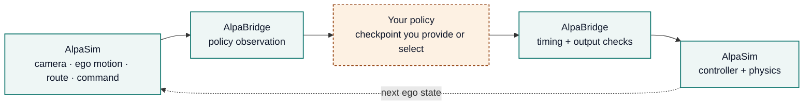

# AlpaBridge: Connect a Driving Policy to NVIDIA AlpaSim

<p align="center">
  <a href="https://github.com/amtellezfernandez/AlpaBridge/actions/workflows/ci.yml"></a>
  <a href="LICENSE"></a>
  
</p>

<p align="center">
  <strong>Run your driving policy through AlpaSim's live simulation loop.</strong><br>
  <a href="docs/getting-started.md">Get started</a> |
  <a href="docs/README.md">Documentation</a> |
  <a href="docs/cli.md">CLI reference</a> |
  <a href="docs/design.md">Architecture</a>
</p>

AlpaBridge connects your driving policy to
[NVIDIA AlpaSim](https://github.com/NVlabs/alpasim). AlpaSim sends it the
live camera image, the car's own motion, the current command, and the route.
AlpaBridge hands these to your policy in a simple format, takes the
trajectory your policy returns, converts it into the format AlpaSim needs,
and lets AlpaSim move the car forward using it.

AlpaBridge also handles the work around this: setting up your AlpaSim
checkout, checking it's ready to run, running many scenes in a row, retrying
failures, keeping a record of each run, and packaging logs for support.
AlpaBridge is not a simulator, and it does not come with its own driving
policy — you bring the policy.

## Demo

Two real AlpaSim runs, each shown as a map view next to its camera feed.
Both are labeled with the real scene and run IDs from that run's records.

<p align="center">
  
</p>

**Top — moving-camera run**
([config + files](artifacts/external/alpasim_dynamic_camera_rollout/)):

- **Map:** the car (green) follows its planned path (orange); the gray box
  is the same nearby vehicle shown in the camera view.
- **Camera:** AlpaSim's live camera render. Each frame is blended with the
  real frame from `0.6` s and `1.2` s earlier, so you can see the trail
  move — proof the image really changes from frame to frame.

**Bottom — NAVSIM run**
([config + files](artifacts/external/alpasim_navsim_reactive_rollout/)):
shows the difference between driving live and just replaying a recorded log.

- **Map:** the driven path (orange) moves away from the original recorded
  path (dashed green) by `16.29` m, and gets flagged `wrong_lane` (it does
  not collide or leave the road).
- **Camera:** the same picture every time — this policy (NAVSIM
  EgoStatusMLP) never looks at the camera, so AlpaSim kept sending it the
  same image on every request. AlpaBridge has a check that catches exactly
  this case (below).

This diagram shows the loop. AlpaSim runs everything except the dashed box —
that's your policy:


```mermaid
flowchart LR
    A["AlpaSim<br/>camera · ego motion · route · command"] --> B["AlpaBridge<br/>policy observation"]
    B --> C["Your policy<br/>checkpoint you provide or select"]
    C --> D["AlpaBridge<br/>timing + output checks"]
    D --> E["AlpaSim<br/>controller + physics"]
    E -.->|next ego state| A

    style A fill:#eef6f5,stroke:#0f766e,stroke-width:1.5px,color:#0f172a
    style B fill:#eef6f5,stroke:#0f766e,stroke-width:1.5px,color:#0f172a
    style C fill:#fdf1e3,stroke:#92400e,stroke-width:1.5px,stroke-dasharray: 4 3,color:#0f172a
    style D fill:#eef6f5,stroke:#0f766e,stroke-width:1.5px,color:#0f172a
    style E fill:#eef6f5,stroke:#0f766e,stroke-width:1.5px,color:#0f172a
```

<details>
<summary>One camera per rollout, and the frozen-camera guard</summary>

Each run uses one camera because that's what the connected AlpaSim car has —
not a limit of AlpaBridge itself. See
[design.md](docs/design.md#camera-count-is-not-hardcoded) for more.

When we connected a policy that does check the camera, this same frozen
image tripped AlpaBridge's check: the first 4 `Drive` calls worked, then the
5th failed with `INVALID_ARGUMENT`, because the camera's timestamp kept
moving forward but the picture didn't. Details: [NAVSIM
evidence](artifacts/external/alpasim_navsim_reactive_rollout/#camera-freshness-control).

</details>

## How It Works

### A Real Example

<p align="center">
  
</p>

Made by
[`scripts/render_readme_example.py`](scripts/render_readme_example.py). The
script builds one input the same way
[`tests/test_alpasim_integration.py`](tests/test_alpasim_integration.py)
does, runs the built-in `route_following` policy, and plots the trajectory
it returns. Run the script yourself to see the same thing.

**In practice:** you write one function for your policy — it takes in what
the car currently sees and knows, and returns a trajectory. AlpaBridge
handles everything else: talking to AlpaSim, timing, retries, and saving
evidence of the run.

### Model Presets

AlpaBridge ships four built-in policies:

| Preset | Purpose | Extra input |
| --- | --- | --- |
| `constant_velocity` | Simple baseline, no setup needed | None |
| `route_following` | Simple baseline that follows the route | None |
| `token_dagger_bc` | Wraps a compatible trained model | A checkpoint file |
| `direct_actor_planner` | Planner that uses other cars' real positions | An actor-state file |

The first two need no checkpoint, so they're the easiest way to test your
AlpaSim setup. Both real runs above use scenes this repo already ships
presets for. Other datasets (nuScenes, nuPlan, Argoverse 2) aren't covered
here yet — see [compatible datasets](docs/womd-targeting.md) for what that
would take.

## Install

Installing and planning a run don't need a GPU:

```bash
uv sync --extra dev
uv run alpabridge-doctor --strict-installed --json
```

Running a real AlpaSim rollout needs: x86_64 Linux, Docker, the NVIDIA
Container Toolkit, a GPU, a local AlpaSim checkout, and local scene files.

## Connect AlpaSim

Check what AlpaBridge would change in your AlpaSim checkout:

```bash
uv run alpabridge-setup \
  --alpasim-root /path/to/alpasim \
  --check-only
```

Apply the changes, then check everything is ready:

```bash
uv run alpabridge-setup --alpasim-root /path/to/alpasim
uv run alpabridge-ready \
  --alpasim-root /path/to/alpasim \
  --scene-preset fresh_3scene
```

The setup command checks your AlpaSim checkout looks as expected before it
changes anything. The readiness command checks your machine, Docker and GPU
access, images, model inputs, and the scenes you picked.

## Plan Or Execute

Print the exact commands this would run, without starting anything:

```bash
uv run alpabridge-launch \
  --mode print \
  --alpasim-root /path/to/alpasim \
  --model route_following \
  --scene-preset fresh_3scene
```

Actually run it, start to finish:

```bash
uv run alpabridge-reproduce \
  --execute \
  --alpasim-root /path/to/alpasim \
  --model route_following \
  --scene-preset fresh_3scene \
  --run-dir runs/route_following \
  --evidence-dir runs/route_following/evidence \
  --json
```

To run many scenes with their own timeouts and retries, use
`alpabridge-batch`. Every run saves its full settings, model inputs, the
exact commands used, simulator records, driver events, summaries, and a
normalized audit — without saving any gated scene data or private
checkpoints.

## Run As A Standalone Driver

Everything above runs AlpaBridge inside AlpaSim itself. AlpaBridge can also
run on its own, as a separate process that an AlpaSim checkout connects to
over the network (using gRPC). External evaluators use this path, since they
only know how to connect to an already-running driver, not load a plugin.
This skips the `Connect AlpaSim` step above completely — AlpaSim just points
at the driver's address.

First, check the driver works on its own — no AlpaSim checkout, GPU, or
checkpoint needed:

```bash
uv run alpabridge-driver --self-test --model route_following
```

To run a real, live loop, start the driver in one terminal:

```bash
uv run alpabridge-driver --model vavam \
  --checkpoint /path/to/vavam.ckpt \
  --tokenizer-checkpoint /path/to/tokenizer.jit
```

Then, in another terminal, from an AlpaSim checkout, point it at the driver:

```bash
ALPASIM_DRIVER_HOST=localhost ALPASIM_DRIVER_PORT=6789 \
  uv run alpasim_wizard +e2e_challenge=dev
```

Any policy listed in
[`src/alpabridge/driver/policy_registry.py`](src/alpabridge/driver/policy_registry.py)
can be picked with `--model`, the same way as the presets above. That's the
four presets above, plus `navsim_ego_status_mlp` and `vavam` (the public
[Valeo VideoActionModel](https://github.com/valeoai/VideoActionModel), a
real 318-million-parameter checkpoint. It needs `torch` and the `vam`
package, which aren't installed by default).

NVIDIA's AlpaSim E2E Challenge is one evaluator that connects this way.
Building a locked-down container for that specific submission format is
covered in [AlpaSim E2E compatibility](docs/challenge-compatibility.md).

## Integration Test Results

Three real, saved AlpaSim runs back this up:

| Run | Result | What it proves |
| --- | --- | --- |
| [Dynamic-camera external driver](artifacts/external/alpasim_dynamic_camera_rollout/) | `pass`, `200` sim steps, live `sensorsim` camera render | The camera image really changes every frame — it's not stuck on one picture. |
| [Reactive NAVSIM external driver](artifacts/external/alpasim_navsim_reactive_rollout/) | `197/197` finite outputs over one `19.93` s rollout | A public checkpoint, the driver, the controller, and the physics all complete one full loop. |
| [E2E challenge-style conformance](artifacts/external/alpasim_e2e_challenge_conformance/) | `197/197` `Drive` calls with a simple baseline, and again with the real 318M-parameter `vavam` policy ([details](docs/challenge-compatibility.md#a-second-run-with-a-real-policy-instead-of-a-baseline)) | The driver connects to AlpaSim's official challenge service and keeps working with a real policy, not just a simple baseline. |

These check that the pieces connect and work together — they don't score
how well any one policy drives.

## Verify

```bash
make test    # 294 tests, no AlpaSim/GPU/checkpoint required
make verify  # + Ruff, coverage, fresh-checkout install smoke test, wheel/sdist build
```

Every push runs the same steps in CI: lint checks, the tests that need no
extra dependencies, coverage, a fresh install, building an installable
package, and a quick test that installs it and runs the real commands. None
of this needs AlpaSim scenes, a GPU, or a checkpoint.

## Scope

AlpaBridge answers one question: does your policy actually drive, live, in a
realistic simulator — not just score well on a recorded log. It connects any
compatible policy to AlpaSim's live loop: camera, car motion, route, and
command go in; a five-second trajectory comes out. No checkpoint trained on
Waymo's WOMD dataset is required.

**What it doesn't do:** turn WOMD scenarios into AlpaSim scenes. A policy
connected through AlpaBridge drives whatever scenes your connected AlpaSim
checkout has, not recorded Waymo intersections. Waymax solves a different
problem (planning research, with no camera image), so neither one replaces
the other. For the full comparison — WOMD vs. AlpaSim vs. Waymax, why this
project uses AlpaSim, and real Waymo camera/LiDAR examples — see [WOMD
targeting](docs/womd-targeting.md).

## Documentation

- [CLI reference](docs/cli.md)
- [Architecture and adapter behavior](docs/design.md)
- [Getting started](docs/getting-started.md)
- [Reproducible runs](docs/reproduction.md)
- [AlpaSim E2E compatibility](docs/challenge-compatibility.md)
- [WOMD targeting and compatible datasets](docs/womd-targeting.md)
- [Changelog](docs/changelog.md)
- [Contributing](.github/CONTRIBUTING.md)
- [Code of conduct](.github/CODE_OF_CONDUCT.md)
- [Security policy](.github/SECURITY.md)

## License

AlpaBridge is released under the [BSD 3-Clause License](LICENSE), and you
can cite it using [`CITATION.cff`](CITATION.cff). Files and run media that
come from third parties keep their own
[third-party notices](LICENSES/THIRD_PARTY_NOTICES.md).

This is an independent project — it is not affiliated with, endorsed by, or
sponsored by Waymo or NVIDIA. It does not include or redistribute Waymo
datasets, AlpaSim binaries, gated scene files, or policy checkpoints.
