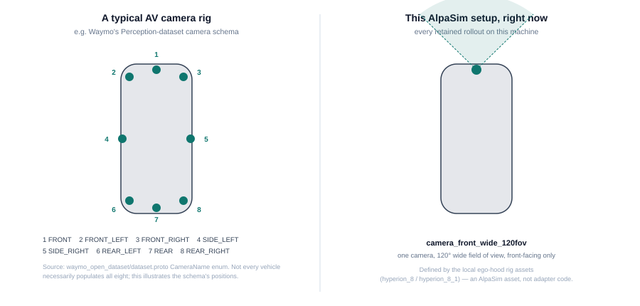

# Design

AlpaBridge connects short-horizon trajectory policies to AlpaSim's long-lived
external-driver service. The policy returns a local ego trajectory; AlpaSim
owns the downstream controller, physics, sensors, and next simulator state.

```text
AlpaSim messages
  -> session state
  -> policy observation
  -> trajectory policy
  -> output validation and resampling
  -> AlpaSim trajectory response
```

## One Interface, Different Kinds Of Policy Internals

AlpaSim owns the rollout: it steps the episode, drives the controller and
physics, and collects metrics. Each step, it calls into whatever policy is
configured through exactly one method:

```python
def predict(self, prediction_input: PredictionInput) -> ModelPrediction: ...
```

AlpaBridge doesn't care what happens inside that call. The built-in
backends already span four different shapes of "how the action gets
decided":

- a single reactive forward pass through a learned checkpoint
  (`token_dagger_bc`, `vavam`);
- a privileged planner that searches over candidate trajectories against
  ground-truth actor state (`direct_actor_planner`);
- a non-privileged receding-horizon search: forward-simulate several
  candidate control sequences through a simple dynamics model, score each
  against real-time (not oracle) route/hazard/speed signal, act on the
  lowest-cost one (`mpc_planner`);
- closed-form kinematics with no search or learned component at all
  (`constant_velocity`, `route_following`).

Nothing about the contract assumes any one of these. A policy that
internally runs a *learned* world model to imagine several futures, or a
pipeline that chains a perception model into a planner into a controller,
is still just one `predict()` call from AlpaBridge's side — the same
serving code (timing, resampling, output validation, evidence capture)
applies unchanged, because none of that internal complexity is visible
outside the method boundary. `mpc_planner` already demonstrates the
"imagine several futures, score them, act on the best one" shape end to
end - the only thing a learned world model would add is replacing its
hand-written kinematics rollout with a learned one, not a new integration
point.

## Input Assembly

The driver receives camera images, ego motion, high-level commands, route
waypoints, and lifecycle messages over time. AlpaBridge:

- keeps each simulator session isolated;
- rejects messages that arrive in an invalid lifecycle state;
- retains route geometry separately from high-level route intent;
- tracks camera timestamps and content freshness;
- exposes only the inputs declared by the selected model adapter.

This policy-interface shape is not an official Waymo message format, and
using it does not imply that a WOMD scenario is running in AlpaSim.

### Camera Count Is Not Hardcoded

In plain terms: every rollout retained in this repo has one camera because
that's what the connected AlpaSim vehicle rig happens to have, not because
the adapter only knows how to handle one. Real self-driving rigs usually
point several cameras in different directions; the specific AlpaSim vehicle
setup connected here only has one, a single wide-angle camera facing
forward:

<p align="center">
  
</p>

This is a property of the connected AlpaSim vehicle's camera hardware, not
a limitation in the adapter. `alpabridge-doctor` checks a connected AlpaSim
setup for exactly this (see below), and the same adapter code supports
more cameras as soon as a rig with more of them is available. The rest of
this section is the technical detail.

`camera_ids` is a plain list, not a fixed slot: camera validation, per-camera
frame-count checks, and the sensor-freshness fingerprint (which combines a
CRC32 across every declared camera, not just the first) all iterate over
however many cameras a preset declares.
`tests/test_alpasim_integration.py::test_baseline_driver_accepts_more_than_one_camera`
and its two neighboring tests exercise the same `predict()` path with two
cameras, including that a frozen-camera rejection still fires when *both*
cameras stop advancing.

The presets shipped here declare one camera (`camera_front_wide_120fov`)
because that's the only camera the connected AlpaSim ego-vehicle rig
defines a mask for — checked directly against
`data/nre-artifacts/ego-hoods/hyperion_8` and `hyperion_8_1`, the two rig
configs referenced by every retained run's `ego_mask_rig_config_id`. This
is an AlpaSim ego-vehicle rig asset property, not a scene-specific or
adapter-specific limit: a different scene would use the same rig and
report the same one camera. Adding a genuinely multi-camera rig is an
upstream AlpaSim/NVIDIA asset question, outside what this repository can
fetch or configure.

`alpabridge-doctor` and `alpabridge-ready` cross-check every public preset's
declared cameras against whatever ego-hood rigs are present under the
connected `--alpasim-root`
(`_preflight_camera_rig_compatibility` in `run_alpasim_local_external.py`),
so a preset asking for a camera no local rig can provide fails loudly at
preflight time — before a live AlpaSim session — rather than failing deep
inside a running rollout. Skip it with `--skip-camera-rig-check` if needed.

## Model Presets

The dependency-light models are:

- `constant_velocity`: a straight-line smoke baseline;
- `route_following`: a waypoint-following baseline;
- `mpc_planner`: forward-simulates a handful of candidate (yaw rate,
  acceleration) control sequences through a simple ego dynamics model and
  picks the lowest-cost rollout against real-time route/hazard/speed
  signal - a real, small receding-horizon search, not a closed-form
  formula like the other two. See
  [`mpc_planner.py`](../src/alpabridge/simulator/mpc_planner.py).

Optional models use the same external-driver boundary. Both show the
adapter handling proprietary artifacts - a privately trained checkpoint, an
oracle actor proxy - rather than only public ones:

- `token_dagger_bc`: a learned token policy with a compatible local checkpoint;
- `direct_actor_planner`: a candidate planner with a scene-matched actor proxy.

The standalone driver (`alpabridge-driver`, see the README's [Policy
Backends](../README.md#policy-backends) table and
[`policy_registry.py`](../src/alpabridge/driver/policy_registry.py)) also
serves the public NAVSIM EgoStatusMLP architecture and `vavam` (the public
[Valeo VideoActionModel](https://github.com/valeoai/VideoActionModel)).
Neither is registered as a general `alpasim.models` preset that runs
inside AlpaSim, because their checkpoint and framework dependencies
(`torch`, `vam`) are external and heavier than the release-core baselines.

## Trajectory Conversion

Policy outputs are interpreted as ego-relative endpoint samples over a
five-second horizon. If the point count already matches
`round(output_frequency_hz * horizon_seconds)`, AlpaBridge returns the trajectory
unchanged. Otherwise it anchors interpolation at the current ego origin,
interpolates x/y positions onto the runtime endpoint grid, and recomputes
headings.

Outputs with non-finite coordinates, invalid shapes, or inconsistent timing are
rejected before they reach the AlpaSim controller.

## Setup And Runtime Checks

`alpabridge-setup` validates an AlpaSim checkout before applying the tracked
override files. `alpabridge-ready` checks platform, environment, Docker/GPU,
runtime image, model inputs, and selected scene assets. `alpabridge-launch` then
materializes the exact driver and simulator commands before optional execution.

Executed workflows retain expanded configuration, commands, provenance, driver
events, normalized audits, and summaries. Private checkpoints and gated scene
assets remain local.

## AlpaSim Overrides

The tracked override layer under `src/alpabridge/alpasim_overrides/` extends the
AlpaSim checkout at its plugin and route-message boundaries. The source copy
under `third_party/alpasim_overrides/` records provenance and modifications.
AlpaBridge policy logic remains in this package; AlpaSim itself is not vendored.

## Non-Goals

AlpaBridge is not:

- a simulator or controller replacement;
- a new autonomous-driving policy;
- a WOMD-to-AlpaSim scene converter;
- a source of AlpaSim scenes or learned checkpoints;
- a policy-performance benchmark.
