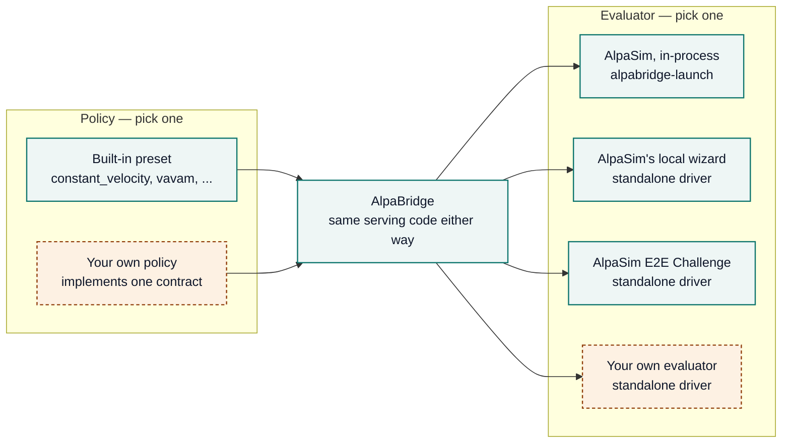

# Extending AlpaBridge

Two independent things are pluggable here: which **policy** runs, and
which **evaluator** runs it. This doc covers both — write your own policy
below, or see [Evaluators](#evaluators) for running one through something
other than the built-in presets.

## Bring Your Own Policy

Implement the contract. Here's the required shape, in outline:

```python
from alpabridge.simulator.alpasim_contract import BaseTrajectoryModel, ModelPrediction

class MyPolicy(BaseTrajectoryModel):
    camera_ids = ["camera_front_wide_120fov"]
    context_length = 1
    output_frequency_hz = 4

    @classmethod
    def from_config(cls, model_cfg, device, camera_ids, context_length, output_frequency_hz):
        return cls()  # load your checkpoint here

    def _encode_command(self, command):
        ...  # map DriveCommand to whatever your policy expects

    def predict(self, prediction_input) -> ModelPrediction:
        trajectory_xy = ...  # your model's output, an (N, 2) array
        headings = ...       # heading at each point; see baseline_drivers.py for one way
        return ModelPrediction(trajectory_xy=trajectory_xy, headings=headings)
```

### Slow Inference?

If your real forward pass can't keep up with how often the driver calls
`predict` — the exact problem `vavam` has, since its native rate is 2 Hz
against the driver's 10 Hz — reuse the same throttling cache instead of
writing your own pose-tracking logic:

```python
from alpabridge.simulator.inference_rate_cache import PoseReanchoredInferenceCache

class MyPolicy(BaseTrajectoryModel):
    def __init__(self):
        self._inference_cache = PoseReanchoredInferenceCache(min_interval_s=0.5)  # your model's real cadence

    def predict(self, prediction_input) -> ModelPrediction:
        def _infer():
            return self._run_real_forward_pass(prediction_input)  # your heavy model call, an (N, 2) array

        trajectory_xy, was_cached = self._inference_cache.get(prediction_input, _infer)
        headings = self._compute_headings_from_trajectory(trajectory_xy)
        return ModelPrediction(trajectory_xy=trajectory_xy, headings=headings)
```

`_infer()` only runs when the cache is empty or older than `min_interval_s`;
otherwise the cache reprojects the last real prediction onto the car's
*current* position instead of replaying it unchanged. It's a general
building block, not vavam-specific — see
[`inference_rate_cache.py`](../src/alpabridge/simulator/inference_rate_cache.py)
for the reprojection math, and
[`vavam_model.py`](../src/alpabridge/simulator/vavam_model.py) for the real,
tested usage this pattern is based on.

### Register It

Matching the [Policy Backends](../README.md#policy-backends) table:

- **Inside AlpaSim**: declare an `alpasim.models` entry point — the same
  mechanism `constant_velocity`, `route_following`, `token_dagger_bc`, and
  `direct_actor_planner` use (see `pyproject.toml`'s
  `[project.entry-points."alpasim.models"]`). Entry-point groups are a
  standard Python packaging mechanism, discovered across every installed
  package, not just one — so this can live in your own package alongside
  AlpaBridge, not inside a fork of it.
- **Standalone driver**: add one
  `register_policy(DriverPolicy("my_policy", my_factory))` call in
  [`policy_registry.py`](../src/alpabridge/driver/policy_registry.py). As of
  today this means changing this repo — see
  [Contributing](../.github/CONTRIBUTING.md) — there's no external plugin
  hook for this path yet.

Either way, nothing about the serving code itself (timing, retries,
evidence capture, the gRPC service) changes — that's the same for every
policy in the [Policy Backends](../README.md#policy-backends) table,
including a future vision-language or world-model one.

Once registered for the standalone driver (see [Evaluators](#evaluators)
below), test it the same way as any built-in:

```bash
uv run alpabridge-driver --self-test --model my_policy
```

## Evaluators

Which policy runs is one choice; which evaluator runs it is a separate,
independent choice. The standalone driver implements AlpaSim's own general,
versioned external-driver gRPC interface (`egodriver.EgodriverService`) —
not something built for any one evaluator — so anything that speaks it can
connect, the same way any policy in the [Policy
Backends](../README.md#policy-backends) table can be selected:



Solid-teal boxes are things AlpaSim/AlpaBridge already ship; dashed-amber
boxes are things you bring yourself. Any policy can pair with any
compatible evaluator — see the table below for exactly which combinations
are tested today, and the [Policy Backends](../README.md#policy-backends)
table for which policies need the standalone driver specifically.

### Evaluation Paths

| Evaluator | What it is | Status |
| --- | --- | --- |
| Inside AlpaSim (`alpabridge-launch` / `alpabridge-reproduce`) | AlpaSim's own driver process loads your policy directly | Tested — see [Integration Test Results](../README.md#integration-test-results) |
| AlpaSim's local wizard, standalone driver | Any AlpaSim checkout's dev preset, pointed at a running `alpabridge-driver` | Tested — see [Integration Test Results](../README.md#integration-test-results) |
| AlpaSim E2E Challenge, standalone driver | NVIDIA's official hosted evaluator — same driver, packaged as a locked-down container | Tested locally — see [AlpaSim E2E compatibility](challenge-compatibility.md) |
| Your own evaluator, standalone driver | Any client speaking the same `egodriver.EgodriverService` interface | Tested — a plain gRPC client (not AlpaSim's wizard) drives one full session in [`tests/test_driver_grpc_client.py`](../tests/test_driver_grpc_client.py) |

The AlpaSim E2E Challenge is the one we've documented most, because it's
the one with a public, external leaderboard to point at — not because the
driver is built around it. A different evaluator speaking the same
protocol is exactly as supported as the Challenge is.

### Run As A Standalone Driver

The [main README](../README.md) covers running AlpaBridge inside AlpaSim
itself (`alpabridge-launch` / `alpabridge-reproduce`) — the simplest way to
try a policy. AlpaBridge can also run on its own, as a separate process. An
AlpaSim checkout (or any other evaluator) then connects to it over the
network (using gRPC). External evaluators use this path, since they only
know how to connect to an already-running driver, not how to load a plugin.
This skips the README's `Connect AlpaSim` step completely — AlpaSim just
points at the driver's address.

First, check that the driver works on its own — no AlpaSim checkout, GPU, or
checkpoint needed:

```bash
uv run alpabridge-driver --self-test --model route_following
```

To run the real loop, start the driver in one terminal:

```bash
uv run alpabridge-driver --model vavam \
  --checkpoint /path/to/vavam.ckpt \
  --tokenizer-checkpoint /path/to/tokenizer.jit
```

In a second terminal, point an AlpaSim checkout at the driver, using
AlpaSim's own local dev preset:

```bash
ALPASIM_DRIVER_HOST=localhost ALPASIM_DRIVER_PORT=6789 \
  uv run alpasim_wizard +e2e_challenge=dev
```

Any policy marked "standalone" in the [Policy
Backends](../README.md#policy-backends) table can be picked with `--model`
this way. `vavam` additionally needs
[`torch`](https://pytorch.org/get-started/locally/) (pick the build for
your hardware — CPU or a specific CUDA version) and the public `vam`
package:

```bash
pip install git+https://github.com/valeoai/VideoActionModel@v1.0.0
```

For a locked-down container built for the AlpaSim E2E Challenge's specific
submission format, see [AlpaSim E2E compatibility](challenge-compatibility.md).
