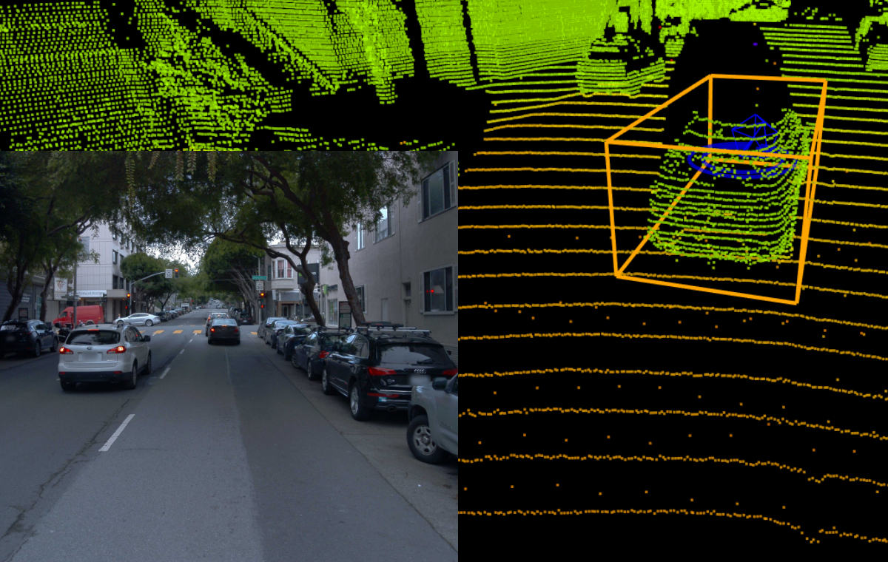
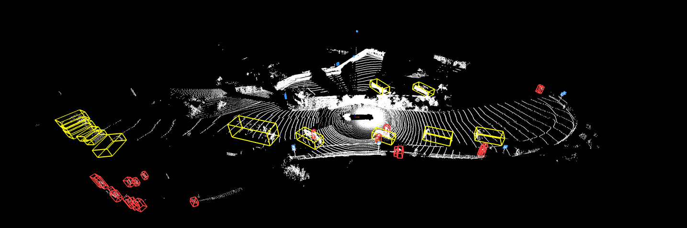

# WOMD Targeting

AlpaBridge implements a trajectory-policy interface on AlpaSim scenes. It does not
load Waymo Open Motion Dataset (WOMD) records into AlpaSim. These are different
targets with different data and runtime requirements.

## What Is WOMD?

<p align="center">
  <a href="https://waymo.com/open/data/motion/"></a>
</p>

The Waymo Open Motion Dataset (WOMD) is a public research dataset of real
driving scenes: over 100,000 twenty-second scenarios recorded at 10 Hz
across six U.S. cities — more than 570 hours over 1,750 km of roads. Each
scenario is picked for an interesting interaction (a merge, an unprotected
turn) and comes with 3D tracks for every nearby vehicle, pedestrian, and
cyclist, plus a matching HD map. It's built for training and testing
motion-prediction and planning models — not for rendering, which is the gap
AlpaSim's scenes and AlpaBridge's adapter fill on the simulation side.

<sub>Ettinger et al., ["Large Scale Interactive Motion Forecasting for
Autonomous Driving: The Waymo Open Motion
Dataset"](https://arxiv.org/abs/2104.10133), 2021. Logo and dataset ©
Waymo LLC — [waymo.com/open](https://waymo.com/open/).</sub>

## Why AlpaSim, Not Waymax?

They are not two options for the same job. By [Waymax's own
description](https://github.com/waymo-research/waymax), it is a vectorized
simulator: agents are bounding boxes, it never renders a camera image, and
it runs in JAX for planning and behavior-prediction research on WOMD.
AlpaSim renders an actual camera feed and runs a real controller and
physics loop. A planner that only ever sees bounding boxes is a different
thing to validate than a policy that has to look at a camera and drive.

| | Waymax | AlpaSim |
| --- | --- | --- |
| Simulates | Vectorized agent state (bounding boxes) | Rendered sensor output + physics |
| Renders a camera feed | No | Yes |
| Built on | JAX | AlpaSim runtime (Docker + GPU) |
| Good for | Planning / behavior-prediction research on WOMD | Closed-loop testing of camera-consuming policies |

AlpaBridge targets the second case: checkpoints that expect a live camera
and a real physics response require a simulator that provides both, which
Waymax does not.

## What Real Camera And LiDAR Data Looks Like

WOMD itself ships no raw sensor pixels or points. Two things are worth
being precise about here, because it's easy to conflate three different
Waymo products:

- **Waymo Open Dataset (Perception)** — a separate dataset from WOMD — is
  the one with real cameras and LiDAR. Its schema (`dataset.proto`) defines
  up to eight camera positions (`FRONT`, `FRONT_LEFT`, `FRONT_RIGHT`,
  `SIDE_LEFT`, `SIDE_RIGHT`, `REAR_LEFT`, `REAR`, `REAR_RIGHT`) and five
  LiDARs (`TOP`, `FRONT`, `SIDE_LEFT`, `SIDE_RIGHT`, `REAR`), with 2D/3D box
  labels, panoptic segmentation, and keypoints. This is what a real frame
  looks like — camera view, LiDAR sweep, and a 3D box together:

  <p align="center">
    
  </p>

  And a fuller LiDAR sweep across a whole intersection, boxes on every
  detected vehicle, pedestrian, and cyclist:

  <p align="center">
    
  </p>

  <sub>Both images: `waymo-research/waymo-open-dataset` on GitHub, commit
  `99a4cb3`, Apache-2.0, © Waymo LLC. Redistributed unmodified; see
  [`THIRD_PARTY_NOTICES.md`](../LICENSES/THIRD_PARTY_NOTICES.md).</sub>

  No official, redistributable sample shows all of a vehicle's cameras at
  once side by side — Waymo has not published one under a license that
  permits reuse here. The [camera-rig
  comparison](design.md#camera-count-is-not-hardcoded) illustrates where
  those camera positions sit around the vehicle; it is a schematic diagram,
  not a real capture.

- **WOMD's newer optional extensions** add compressed sensor data to some
  scenarios, but not as a normal renderable video: camera data is
  tokenized (each image becomes 256 integers indexing a pre-trained
  codebook, not pixels you can display), and LiDAR is a compressed format
  that decompresses to real point clouds. See Waymo's own
  `tutorial_womd_camera.ipynb` and `tutorial_womd_lidar.ipynb` for the
  exact mechanics. Neither changes AlpaBridge's scope: this adapter still
  talks to AlpaSim's rendered camera and physics, not to WOMD's tokens or
  point clouds.

## Choose The Target

| Target | Status | Correct starting point |
| --- | --- | --- |
| Run a policy through AlpaSim's external driver | Implemented | Use AlpaBridge's presets and setup tooling. |
| Connect a policy trained on WOMD data to AlpaSim | Implemented, but checkpoint compatibility is model-specific | Match the checkpoint's observations, coordinates, timing, and route inputs to an AlpaBridge preset. |
| Run policies directly on WOMD records | Not provided here | Use [Waymax](https://github.com/waymo-research/waymax) instead. |
| Render a real WOMD scenario inside AlpaSim | Not implemented | Needs a separate map/actor/signal converter — nobody's built one yet. |
| Make logged agents react to the ego | Not implemented | Logged agents replay their recorded future; they don't respond to what the ego does. |

## Target A Policy At AlpaSim

AlpaSim sends live sensor, ego-motion, command, and navigation messages to an
external driver. AlpaBridge assembles those messages into policy inputs and
expects a five-second ego-relative trajectory in return.

Start with a dependency-light run:

```bash
uv run alpabridge-launch \
  --mode print \
  --alpasim-root /path/to/alpasim \
  --model route_following \
  --scene-preset fresh_3scene
```

Before registering a learned checkpoint, record:

- the exact observation tensors and preprocessing;
- the ego and world coordinate conventions;
- whether route geometry, a high-level command, or neither is required;
- input cadence, output horizon, point count, and timestamp convention;
- checkpoint revision, file hash, framework version, and device requirements;
- how missing cameras, routes, or actor state must be handled.

`token_dagger_bc` is a checkpoint adapter, not a promise that an arbitrary
WOMD-trained checkpoint has compatible inputs. Incompatible checkpoints should
fail readiness rather than be silently reshaped.

## Run Actual WOMD Records

WOMD contains logged agent tracks, vector-map features, traffic-control state,
and scenario metadata. A WOMD-native stack should retain those semantics rather
than converting them through an unrelated simulator scene format.

See [Why AlpaSim, Not Waymax?](#why-alpasim-not-waymax) above for why these
two are not interchangeable: Waymax is vectorized (bounding boxes, no
camera render); AlpaSim renders a real sensor feed and runs physics.

Waymax provides a direct WOMD loading and simulation path. A production
AlpaBridge-to-Waymax binding would still need to map:

- simulator state and policy observations;
- SDC ownership and action application;
- reset, step, termination, and log-playback behavior;
- route provenance and policy input requirements;
- timestamps, action cadence, and output horizon;
- licensed dataset access, versions, and retained run metadata.

That binding is not part of this adapter release.

## Convert WOMD Scenes Into AlpaSim

Running a WOMD record inside AlpaSim is a separate scene-conversion project. At
minimum it requires:

- license-compliant WOMD access and artifact provenance;
- vector-map geometry and topology conversion;
- dynamic map state and traffic-control conversion;
- actor dimensions, poses, velocities, identities, and ownership;
- route candidates or navigation targets;
- a common frame, origin, heading convention, timestamp, and tick rate;
- AlpaSim-compatible scene and renderable assets;
- explicit treatment of logged versus reactive non-ego agents.

Until those pieces exist and are tested together, describe AlpaBridge as a policy
adapter for AlpaSim scenes, not as a WOMD-to-AlpaSim converter.

## Compatible Datasets And Checkpoints

The adapter contract is dataset-agnostic: it needs timestamped camera,
ego-motion, command, and route input, and returns a short-horizon ego
trajectory. Any driving-log dataset or simulator that can supply that
shape can be wired in as a new model preset.

**What's wired up today:**

| Dataset / source | Where | Status |
| --- | --- | --- |
| None (kinematic baselines) | `constant_velocity`, `route_following` | Public, dependency-light, no checkpoint required. |
| A private token-based BC/DAgger checkpoint | `token_dagger_bc` | Public adapter, private checkpoint (not distributed here). |
| Scene-matched actor state | `direct_actor_planner` | Public adapter, requires a local oracle actor proxy. |
| NAVSIM `EgoStatusMLP` (trained on OpenScene, a compact re-release of nuPlan) | [reactive rollout evidence](../artifacts/external/alpasim_navsim_reactive_rollout/) | Public, hash-pinned checkpoint; demonstrated outside the standard `--model` preset flow; camera-blind. |
| Waymo Open Motion Dataset (WOMD) | shape inspiration only | Not wired to any preset. |

**Datasets that would fit but are not implemented yet** — public driving-log
datasets with the observation/route/trajectory shape this adapter expects;
none have a preset in this repository, so adding one is a good first
contribution:

| Dataset | Maintainer | What a preset would need |
| --- | --- | --- |
| [nuScenes](https://www.nuscenes.org/) | Motional | Match nuScenes' camera rig, ego-pose, and command/route conventions to a new `alpasim.models` entry point. |
| [nuPlan](https://www.nuscenes.org/nuplan) | Motional | A closed-loop planner preset matching nuPlan's action space and route/goal representation. |
| [Argoverse 2](https://www.argoverse.org/av2.html) | Argo AI / Woven | Map and agent-trajectory schema conversion to the adapter's route and ego-motion inputs. |
| Your own driving logs or simulator | — | Any recorded or simulated log with camera, ego-motion, command, and route data can be wrapped in a preset, same as the datasets above. |

**Adding a new dataset or checkpoint preset:** before registering one,
record the exact observation tensors and preprocessing the checkpoint
expects; the ego and world coordinate conventions; whether route geometry
or a high-level command is required; input cadence, output horizon, point
count, and timestamp convention; checkpoint revision, file hash, framework
version, and device requirements; and how missing cameras, routes, or
actor state must be handled. Then implement the adapter as an
`alpasim.models` entry point (see the existing presets in
`src/alpabridge/simulator/`), add a config file under
`src/alpabridge/simulator/alpasim_configs/driver/`, and open a PR — see
[Contributing](../.github/CONTRIBUTING.md). A preset is not a claim that
the checkpoint is well-suited to AlpaSim scenes; readiness and conformance
checks should fail loudly on incompatible inputs rather than silently
reshaping them.

## Official References

- [Waymo Open Dataset](https://waymo.com/open/)
- [WOMD format documentation](https://waymo.com/open/data/motion/)
- [Waymax repository](https://github.com/waymo-research/waymax)
- [NVIDIA AlpaSim repository](https://github.com/NVlabs/alpasim)
